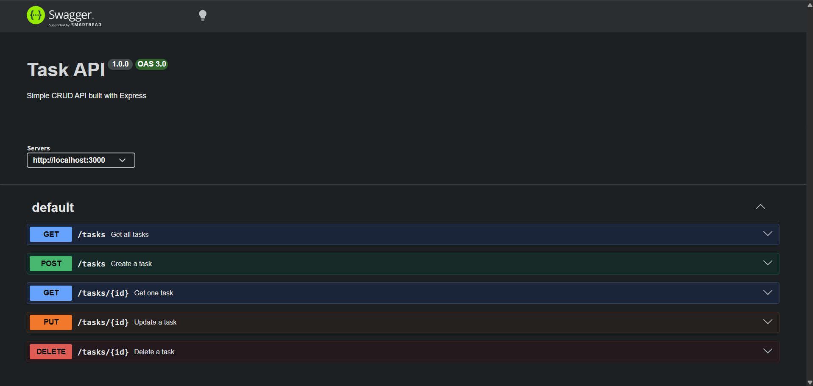

# Task API

A simple RESTful CRUD API built with Node.js and Express. It supports creating, reading, updating, and deleting tasks stored in memory. The project also includes interactive API documentation using Swagger UI.

## Features

- Create tasks
- View all tasks
- View a single task
- Update tasks
- Delete tasks
- Input validation
- Swagger UI documentation

## Technologies Used

- Node.js
- Express.js
- Swagger UI Express

## Installation

1. Clone the repository

```bash
git clone https://github.com/umayyah02/crud-api.git
```

2. Open the project

```bash
cd crud-api
```

3. Install dependencies

```bash
npm install
```

4. Start the server

```bash
node server.js
```

The server will start on:

```
http://localhost:3000
```

Swagger documentation:

```
http://localhost:3000/docs
```

---

# API Endpoints

| Method | Endpoint | Description |
|---------|----------|-------------|
| GET | / | API information |
| GET | /health | Health check |
| GET | /tasks | Get all tasks |
| GET | /tasks/:id | Get one task |
| POST | /tasks | Create a task |
| PUT | /tasks/:id | Update a task |
| DELETE | /tasks/:id | Delete a task |

---

# Example Request

Create a task

```bash
curl -i -X POST http://localhost:3000/tasks -H "Content-Type: application/json" -d "{\"title\":\"Buy milk\"}"
```

Example Response

```http
HTTP/1.1 201 Created

{
  "id": 4,
  "title": "Buy milk",
  "done": false
}
```

---

# Swagger UI

Open:

```
http://localhost:3000/docs
```

Use the **Try it out** button to test every endpoint.

---

# Project Structure

```
crud-api/
│
├── node_modules/
├── server.js
├── openapi.json
├── package.json
├── package-lock.json
├── README.md
└── swagger-ui.png
```
---

## Swagger Screenshot



# Author

**Umayyah Noor**